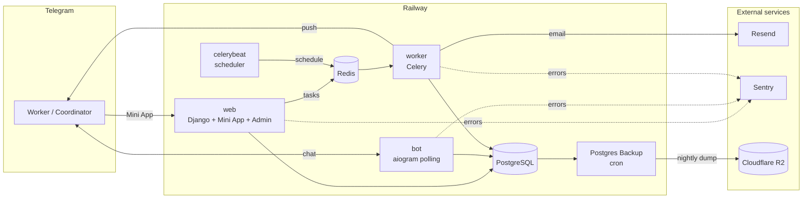

# Apolo — Absence Tracking for Staffing Agencies

[](https://github.com/Brebston/apolo_freedays/actions/workflows/ci.yml)


A Telegram Mini App and bot for a Polish staffing agency. Workers request days off, report sick leave (L4) and attach the sick note, and send questions to administration or accounting — straight from Telegram, in Ukrainian, Polish, English or Russian. Coordinators decide in one tap; administrators manage everything in Django Admin.

**Languages:** English · [Українська](README_UA.md)

## Contents

- [Features](#features)
- [Business rules](#business-rules)
- [Architecture](#architecture)
- [Tech stack](#tech-stack)
- [Getting started](#getting-started)
- [Configuration](#configuration)
- [Deployment](#deployment)
- [Django Admin](#django-admin)
- [Operations](#operations)
- [Security and privacy](#security-and-privacy)
- [Development](#development)
- [Troubleshooting](#troubleshooting)
- [Roadmap](#roadmap)

## Features

### For workers (Telegram Mini App)

- **Access by Telegram ID only.** No registration or passwords: an administrator adds the worker, and the app opens. Anyone else sees their Telegram ID and a button to send it to a coordinator.
- **Days off** on a calendar that shows, before you tap, which days are fully booked and which you have already requested. The monthly limit is shown as a row of dots that fills as you select days.
- **Sick leave (L4)** with the sick note attached as a photo or PDF: the file is emailed to the coordinator automatically. Photos are compressed on the phone before upload (a 5.7 MB photo becomes ~0.8 MB).
- **Reminders to attach the sick note** — on the confirmation screen, on the home screen, and as a bot message two days later if the document is still missing (up to three times).
- **Requests to administration** (documents: insurance certificate, *załącznik*, …) and **to accounting** (salary questions).
- **Remaining days off** for the current and next month on the home screen.
- **Cancel your own request** — any pending one, or an approved day off that has not started yet.
- **My requests** — every request with its status in one list.

### For coordinators

- A push notification for every new request with **Approve / Reject** buttons right in the chat — or decide in the coordinator panel of the app. Sick leave (L4) cannot be rejected.
- When a worker cancels, the decision buttons disappear from the original notification.
- Every request and sick note also arrives by **email** (Polish HTML template).

### For administrators (Django Admin)

- **Workers:** add one by one, or **bulk-import from CSV** with a row-by-row preview. Excel files in Polish or Cyrillic encodings and headers in four languages are recognised.
- **Projects and limits:** monthly day-off limit per worker, maximum people off per day, and overrides for specific dates.
- **Statistics in Excel:** eight sheets and six charts (by project, month, weekday and worker), in English, Polish or Ukrainian. Every figure is a live formula over the source data.
- **Broadcasts** to all workers or selected ones — one-off or recurring (daily, weekly, monthly), with an emoji picker.
- **Departments:** who receives administration and accounting requests. Decisions are made by clicking a button in the email.
- **Sick notes:** view and download attached files on the request page.

## Business rules

These are the rules the system enforces. Limits and permissions are always checked on the server; the calendar in the app only shows them in advance.

### Access

- `/start` (and the **🌐 Language** button) always asks for the language first, then looks the user up by Telegram ID.
- **Found and Active** → the main menu. **Not found or not Active** → an "access denied" message with a **Get my Telegram ID** button that produces a ready-to-forward text; the menu shrinks to the language button only.
- Access is re-checked on every action, not just on `/start`, so unchecking **Active** takes effect immediately. Request history is kept.
- Workers use both the classic bot menu and the Mini App (menu button **Apolo**) — both lead to the same data.

### Days off and sick leave (L4)

- Past dates cannot be selected. A sick leave covers at most **31 days** per request.
- **Monthly limit** (`Project → day-off limit`): the days off a worker has in a calendar month in that project — pending and approved requests plus the days being selected — cannot exceed the limit. Rejected and cancelled requests do not count.
- **People per day:** a staffing limit for that specific date wins; otherwise the project's general limit applies; if neither is set, there is no limit. Pending and approved requests take a place; rejected and cancelled ones do not.
- In the Mini App a worker cannot request a date they already have a request for, and simultaneous submissions to one project are processed one at a time, so two people cannot take the last free place together.
- After submitting, all coordinators of the project get a push notification with decision buttons, and the project's email recipients get an email.

### Decisions

- A coordinator is a user with **Staff** who is listed among the project's coordinators. The coordinator panel shows only their projects' requests; a superuser sees all.
- Sick leave (L4) can only be approved.
- Only a pending request can be decided. The first decision wins — a second click shows "already processed".
- The worker gets a push notification with the decision.

### Cancellation

- A worker can cancel any **pending** request, or an **approved day off that has not started yet**. Started sick leave and processed administration/accounting requests cannot be cancelled.
- On cancellation the decision buttons disappear from the coordinators' notifications, they get a reply saying the request was cancelled, and the project's email recipients get an *Anulowano* email. The freed days no longer count toward any limit.

### Requests to administration and accounting

- Free text up to 2,000 characters; no project or dates.
- Emailed to the department's responsible people (**Departmental points of contact**, To/CC). Their current profile email is used.
- The email has **Zaakceptuj / Odrzuć** buttons. The link opens a confirmation page and the decision is applied only after confirming (a `POST`), so mail scanners cannot trigger it. Only a pending request can be decided; after that — or after the worker cancels — the link shows "already processed".
- The worker gets a push notification with the decision.

### Sick notes

- PDF or images, up to **5 files per upload**, **10 per request**, **10 MB per file** and **25 MB per upload**. The type is checked by file content.
- Emailed to the same recipients as the request. A later upload arrives as an *Uzupełnienie* (supplement) email.
- Reminders: first after `SICK_NOTE_REMINDER_AFTER_DAYS`, then every `SICK_NOTE_REMINDER_INTERVAL_DAYS`, at most `SICK_NOTE_REMINDER_MAX` times; not for rejected or cancelled requests.
- File contents are deleted `SICK_LEAVE_FILE_RETENTION_DAYS` after being emailed; the record (name, size, dates) stays.

### Emails

| Event | Recipients |
| --- | --- |
| New day off / sick leave, cancellation, sick note | The project's email recipients (**Projects → email recipients**, To/CC) |
| New request to administration / accounting | The department's responsible people (**Departmental points of contact**) |

> **An email is sent only if the project (or department) has at least one "To" recipient.** With only CC recipients, or none, no email goes out — and no error is shown.

All emails are in Polish, with an HTML version and a plain-text fallback.

### Broadcasts

- **Audience:** all active users, or selected users.
- **One-off:** sent once at **Scheduled at** — the field must be filled in.
- **Recurring:** daily, weekly (weekday) or monthly (day of month) at the send time. A monthly broadcast on the 31st goes out on the last day of shorter months.
- The scheduler checks every 5 minutes, so a broadcast may arrive up to 5 minutes after its time. Each recurring broadcast is sent at most once per day, week or month.
- **Send selected broadcasts now** in the list sends immediately. After each send the list shows the time and how many messages were delivered or failed. Telegram rate limits (429) are respected automatically.

## Architecture



All application services are built from **one Docker image** and differ only in the start command (`entrypoint.sh`):

| Service | Start command | Role |
| --- | --- | --- |
| `web` | `./entrypoint.sh web` | Runs migrations, serves Django Admin, the JSON API (`/api/`), the Mini App (`/app/`) and email decision links |
| `bot` | `./entrypoint.sh bot` | Telegram bot (long polling); sets the menu button that opens the Mini App |
| `worker` | `./entrypoint.sh celery` | Background jobs: emails, push notifications, broadcasts |
| `celerybeat` | `./entrypoint.sh celery-beat` | Scheduler — **exactly one instance** |

> `./entrypoint.sh celery-all` runs worker and scheduler in one process to save resources. Use it **instead of** separate `worker` + `celerybeat`, never alongside them — two schedulers send every broadcast and reminder twice.

### Scheduled jobs

| Job | When | What it does |
| --- | --- | --- |
| `check_and_send_due_broadcasts` | every 5 min | Sends broadcasts whose time has come |
| `remind_missing_sick_notes` | daily 10:00 | Reminds workers to attach a missing sick note |
| `purge_old_sick_leave_files` | daily 03:30 | Deletes sick-note file contents emailed more than N days ago (the record stays) |

Times are `Europe/Warsaw`.

## Tech stack

| Layer | Technology |
| --- | --- |
| Backend | Python 3.12, Django 5.0, Gunicorn, WhiteNoise |
| Bot | aiogram 3 |
| Background jobs | Celery 5 + Redis |
| Database | PostgreSQL 16 |
| Mini App | React 18 + Vite 5, Telegram WebApp SDK |
| Email | [Resend](https://resend.com) via `django-anymail` |
| Error monitoring | [Sentry](https://sentry.io) |
| Hosting | [Railway](https://railway.com), domain on Cloudflare |
| Backups | Railway *Postgres Backup* template → Cloudflare R2 |
| Excel | openpyxl |

### Project layout

```text
api/            JSON API for the Mini App, Telegram initData auth, Celery tasks for notifications
bot/            aiogram bot: handlers, keyboards, translations (bot/locales.py)
config/         Django settings, URLs, Celery app
core/           Models, admin, email templates, limit logic (services.py),
                file checks (sick_leave_files.py), Excel report (stats_export.py)
users/          Custom User model, admin, CSV import (csv_import.py)
webapp/         React Mini App (src/screens, src/components, src/i18n.js)
entrypoint.sh   Start modes for every service
```

## Getting started

### Prerequisites

- Docker and Docker Compose
- Node.js 20 (only to build the Mini App locally)
- A Telegram bot token from [@BotFather](https://t.me/BotFather)

### Run locally

```bash
git clone https://github.com/Brebston/apolo_freedays.git
cd apolo_freedays
cp .env.example .env                   # fill in the values — see Configuration

cd webapp && npm install && npm run build && cd ..
docker compose up --build
docker compose exec web python manage.py createsuperuser
```

- Admin: <http://localhost:8000/admin/>
- Health check: <http://localhost:8000/healthz>

The Compose volume `.:/app` hides the Mini App built inside the image, which is why it is built on the host once. Repeat `npm run build` after changing the frontend.

Compose starts `db` and `redis`, waits for their health checks, runs the one-off `migrate` service, and only then starts `web`, `bot`, `celery` and `celery-beat`.

### Run without Docker

Requires Python 3.12, PostgreSQL and Redis running locally.

```bash
python3.12 -m venv .venv && source .venv/bin/activate
pip install -r requirements.txt
cp .env.example .env              # POSTGRES_HOST=localhost, REDIS_URL=redis://localhost:6379/0
python manage.py migrate
python manage.py createsuperuser

# four terminals:
python manage.py runserver
python manage.py runbot
celery -A config worker -l info
celery -A config beat -l info
```

### Develop the Mini App in a browser

Telegram only opens Mini Apps over HTTPS, so for local work the app can run in an ordinary browser. Set `DJANGO_DEBUG=1` and `WEBAPP_DEV_TELEGRAM_ID=<your Telegram ID>` in `.env`, then:

```bash
python manage.py runserver        # terminal 1
cd webapp && npm run dev          # terminal 2 → http://localhost:5173
```

Vite proxies `/api` to Django. The ID bypass only works with `DEBUG=1`.

## Configuration

All settings come from environment variables. `.env.example` lists them.

### Required

| Variable | Description |
| --- | --- |
| `DJANGO_SECRET_KEY` | Long random string. Generate: `python -c "import secrets; print(secrets.token_urlsafe(50))"` |
| `DJANGO_ALLOWED_HOSTS` | Comma-separated hosts, e.g. `apolo.blacky.click,.up.railway.app` |
| `CSRF_TRUSTED_ORIGINS` | Full origins, e.g. `https://apolo.blacky.click` |
| `POSTGRES_DB`, `POSTGRES_USER`, `POSTGRES_PASSWORD`, `POSTGRES_HOST`, `POSTGRES_PORT` | Database connection |
| `REDIS_URL` | Celery broker, e.g. `redis://redis:6379/0` |
| `BOT_TOKEN` | Telegram bot token. Also used to verify the Mini App signature, so it must be identical on every service |
| `RESEND_API_KEY` | Resend API key for all outgoing email |
| `DEFAULT_FROM_EMAIL` | Sender, e.g. `Apolo <notifications@apolo.blacky.click>`. The domain must be verified in Resend |
| `SITE_BASE_URL` | Public URL used in email links, e.g. `https://apolo.blacky.click` |
| `WEBAPP_URL` | Mini App URL for the bot's menu button, e.g. `https://apolo.blacky.click/app/` |

### Optional

| Variable | Default | Description |
| --- | --- | --- |
| `DJANGO_DEBUG` | `0` | `1` only for local development |
| `SENTRY_DSN` | — | Enables error monitoring. Without it Sentry stays off |
| `SENTRY_ENVIRONMENT` | `production` | Environment name shown in Sentry |
| `SICK_NOTE_REMINDER_AFTER_DAYS` | `2` | First reminder this many days after an L4 without a document |
| `SICK_NOTE_REMINDER_INTERVAL_DAYS` | `2` | Days between reminders |
| `SICK_NOTE_REMINDER_MAX` | `3` | Maximum reminders per request |
| `SICK_LEAVE_FILE_RETENTION_DAYS` | `90` | How long sick-note files are kept after being emailed |
| `WEBAPP_DEV_TELEGRAM_ID` | — | Local browser development only (with `DJANGO_DEBUG=1`) |

`RAILWAY_SERVICE_NAME` is set by Railway automatically and tags Sentry events with `web`, `bot`, `worker` or `celerybeat`.

## Deployment

Production runs on Railway at `apolo.blacky.click`.

### 1. Railway services

1. **New Project → Deploy from GitHub repo**, then add **PostgreSQL** and **Redis**.
2. Create `web`, `bot`, `worker` and `celerybeat` from the same repository, each with its start command from the [table above](#architecture). Only `web` gets a public domain.
3. Give every service the same variables (**Variables → Raw Editor**). Database and Redis values reference Railway's own services:

   ```env
   POSTGRES_DB=${{Postgres.PGDATABASE}}
   POSTGRES_USER=${{Postgres.PGUSER}}
   POSTGRES_PASSWORD=${{Postgres.PGPASSWORD}}
   POSTGRES_HOST=${{Postgres.PGHOST}}
   POSTGRES_PORT=${{Postgres.PGPORT}}
   REDIS_URL=${{Redis.REDIS_URL}}
   ```

4. Keep `celerybeat` at **one replica**.

Every push to `main` redeploys all services. `web` applies migrations on start.

### 2. Domain (Cloudflare)

1. Railway: `web` → **Settings → Networking → Custom Domain** → `apolo.blacky.click`. Copy the CNAME target.
2. Cloudflare DNS: add `CNAME apolo → <target>` with **Proxy status: DNS only** (grey cloud). Railway already sits behind Cloudflare; the orange proxy causes error 1000.
3. Wait for the green check in Railway — the certificate is issued automatically.

### 3. Telegram

In [@BotFather](https://t.me/BotFather): `/mybots` → your bot → **Bot Settings → Configure Mini App** → `https://apolo.blacky.click/app/`. The bot also sets its menu button on every start.

### 4. Email (Resend)

1. Resend → **Domains → Add domain** — the domain used in `DEFAULT_FROM_EMAIL`.
2. Add the DNS records Resend shows (SPF, DKIM) in Cloudflare DNS and wait for **Verified**.
3. Resend → **API Keys** → create a key → set `RESEND_API_KEY` on `web` and `worker`.

### 5. Error monitoring (Sentry)

1. Create a **Django** project in Sentry and copy its DSN. Pick the EU region if possible.
2. Set `SENTRY_DSN` on `web`, `bot`, `worker` and `celerybeat`.
3. Do **not** paste Sentry's sample `sentry_sdk.init(...)` into `settings.py` — initialisation already exists, and the sample enables `send_default_pii=True`, which this project deliberately disables.

A new Sentry organisation starts on a 14-day Business trial and then moves to the free Developer plan automatically; no payment is needed.

### 6. Backups (Cloudflare R2)

Built-in Railway backups may be unavailable on the Hobby plan and can only be restored inside the same project, so a nightly copy is kept **outside Railway**.

1. **Cloudflare R2:** create a **private** bucket `apolo-backups` (EU jurisdiction). Add a lifecycle rule: delete objects after **30 days**. Create an R2 API token with **Object Read & Write** on this bucket only.
2. **Railway:** **+ Create → Template → Postgres Backup** (by Railway Templates). Set:

   ```env
   BACKUP_DATABASE_URL=${{Postgres.DATABASE_URL}}
   AWS_ACCESS_KEY_ID=<R2 access key id>
   AWS_SECRET_ACCESS_KEY=<R2 secret access key>
   AWS_S3_BUCKET=apolo-backups
   AWS_S3_REGION=auto
   AWS_S3_ENDPOINT=<R2 S3 endpoint>
   SINGLE_SHOT_MODE=true
   ```

3. Keep the **Daily** cron schedule. With `SINGLE_SHOT_MODE` the service runs for a few seconds per night and exits. Delete the Railway **Bucket** that the template creates — backups go to R2.

Deploying the template runs the first backup immediately; check that a file appears in the bucket.

## Django Admin

The admin interface is in English; its language is set separately from the bot by `LANGUAGE_CODE` in `config/settings.py`.

| Section | What it holds |
| --- | --- |
| **Users** | Workers and coordinators. **Active** = access to the bot; **Staff** = coordinator (and Django Admin login). Import from CSV here |
| **Regions** | Regions used to group projects (Łódź, Warszawa, …) |
| **Projects** | Name, region, monthly day-off limit, people per day (empty = no limit), coordinators, and — inline — **email recipients** (To/CC) and date-specific limits |
| **Staffing limits for specific dates** | People-per-day overrides for a single date of a project |
| **Reporting** | All day-off and sick-leave requests, with filters; attached sick notes on each request; **📊 Statistics (Excel)** |
| **Reporting to Administration/Accounting** | Requests to administration and accounting with their status |
| **Departmental points of contact** | Who receives administration or accounting requests, To/CC — a user profile, not a free-typed address |
| **Newsletters** | Broadcasts to workers |

**Users:**

- First and last name use **Latin letters and hyphens only** — no spaces, digits or diacritics.
- Only the Telegram ID and name are needed for bot access; email, phone and password are optional.
- A password is needed only for people who log in to Django Admin. Without one, the account cannot log in to the admin but the bot works normally.

### Everyday tasks

| Task | Where |
| --- | --- |
| Give a worker access | Admin → Users → **Add**, or **⬆ Import from CSV** |
| Revoke access, keep history | Uncheck **Active** on the user |
| Make someone a coordinator | Check **Staff** and add them to the project's coordinators |
| Set limits | Admin → Projects (monthly limit, people per day) and Staffing limits for specific dates |
| Who receives admin/accounting requests | Admin → Departmental points of contact |
| Statistics | Admin → Reporting → **📊 Statistics (Excel)** |
| Send a message to workers | Admin → Newsletters |

CSV import columns: `first_name`, `last_name`, `phone`, `telegram_id` (a template is downloadable on the import page). Names must use Latin letters.

## Operations

### Restore drill (monthly)

A backup you have never restored is only a hope. Once a month, download the latest dump from R2 and restore it into a throwaway database:

```bash
docker run -d --name restore-test -e POSTGRES_PASSWORD=test postgres:16
docker exec -i restore-test psql -U postgres < backup.sql      # after unpacking the archive
docker exec restore-test psql -U postgres -c "SELECT count(*) FROM core_absencerequest;"
docker rm -f restore-test
```

If the dump starts with `PGDMP`, use `pg_restore -U postgres -d postgres` instead of `psql`.

### Storage

Sick notes are stored in PostgreSQL rather than on disk, because each Railway service has its own ephemeral disk. Photos are compressed on the device first, so about ten sick notes a month add roughly 15 MB. File contents are purged automatically after `SICK_LEAVE_FILE_RETENTION_DAYS`; no manual cleanup is needed. After upgrading from the Railway Trial to Hobby, grow the Postgres volume with **Live Resize** — it does not grow automatically.

## Security and privacy

The app processes personal and health data (sick notes), so privacy is built in:

- **Whitelist access.** Only users added by an administrator can use the bot and the app. The `Active` flag revokes access instantly.
- **Signed requests.** Every API call carries Telegram's `initData`, verified with HMAC-SHA256 against `BOT_TOKEN` and rejected after 24 hours.
- **Upload checks.** Files are validated by their content signature, not their extension. PDF and common image formats are accepted, including HEIC from iPhones; disguised executables are rejected. Size and count limits apply.
- **Email decision links.** Each administration or accounting request gets a random 32-byte token. The link only shows a confirmation page, and the decision is applied on `POST`, so mail scanners cannot trigger it.
- **Sentry** runs with `send_default_pii=False` and never receives request bodies.
- **Data location.** R2 bucket and Sentry in EU regions; the R2 bucket is private.
- **Admin sessions** expire after 10 minutes of inactivity.

## Development

### Migrations

Migrations are committed to Git; containers only apply them. After changing a model:

```bash
python manage.py makemigrations users core
git add core/migrations users/migrations
```

CI fails if a model changes without a migration.

> **New files are not picked up by `git commit -a` or `git add -u`.** Run `git status` and add untracked files explicitly — a missing new module is the most common cause of a red CI.

### Continuous integration

GitHub Actions (`.github/workflows/ci.yml`) runs on every push and pull request to `main`:

| Job | Checks |
| --- | --- |
| `django-checks` | Syntax, `manage.py check`, missing migrations, migrations against PostgreSQL 16 + Redis 7, `collectstatic` |
| `docker-build` | Builds the image, validates `docker-compose.yml` |
| `webapp-build` | Builds the Mini App |

### Adding a language

1. Mini App: add a dictionary to `webapp/src/i18n.js` (plus month and weekday names).
2. Bot: add the key to every entry of `TEXTS` in `bot/locales.py` and to the calendar names in `bot/keyboards/calendar.py`.
3. Add the language to `users.models.Language`, create a migration, and add it to the language picker.

The Django Admin language is independent: `LANGUAGE_CODE` in `config/settings.py`.

## Troubleshooting

| Symptom | Cause and fix |
| --- | --- |
| CI: `ImportError` / `cannot import name` | A new file was not committed. `git status`, then `git add` the untracked files |
| CI: `makemigrations --check` fails | Model changed without a migration — run `makemigrations` and commit the result |
| Bot silent, no **Apolo** menu button | `bot` service not running: check its start command and logs |
| `TelegramConflictError` | The same `BOT_TOKEN` runs in two places — stop the other instance |
| Broadcasts or reminders arrive twice | Two schedulers: `celery-all` together with `celerybeat`, or more than one `celerybeat` replica |
| Mini App says "Open in Telegram" | Opened outside Telegram, or `BOT_TOKEN` on `web` differs from the bot's |
| `/app/` shows "Mini App не зібрано" | The frontend build stage failed — check the `web` build log |
| No emails | The project or department has no **To** recipient; `RESEND_API_KEY` missing on `worker`; or the sender domain is not verified in Resend |
| A bot button spins and nothing happens | An error in the handler — check the `bot` logs (and Sentry) at the moment of the click |
| A blocked user still sees the full menu | Telegram keeps the old keyboard until the next message — the user should send `/start` |
| Admin has no styles, or the emoji picker is missing | Static files not collected — redeploy `web` (it runs `collectstatic`), then hard-refresh the browser |
| `WORKER TIMEOUT` in `web` logs | A request took over 60 s — usually a very large upload on a slow connection; check the `--timeout` in `entrypoint.sh` |
| CI does not start on push | The branch is not listed under `on: push: branches` in `ci.yml`, or Actions are disabled in repository settings |
| Email buttons point to `localhost` | `SITE_BASE_URL` not set |
| `DisallowedHost` / CSRF 403 in admin | Domain missing from `DJANGO_ALLOWED_HOSTS` / `CSRF_TRUSTED_ORIGINS` |
| Custom domain has no green check | CNAME wrong or Cloudflare proxy enabled — switch to **DNS only** |
| A one-off broadcast never went out | `Scheduled at` is empty — fill it in or use **Send now** |

## Roadmap

- **Keep bot dialogs across restarts:** move the aiogram FSM from memory to Redis. Today an unfinished dialog in the classic bot menu is lost on every restart — which on Railway means every push.
- **Check project membership on bot decision buttons**, as the Mini App API already does. Today the buttons only reach the project's coordinators, but the handler itself checks just the Staff flag.
- **Pagination** in the coordinator panel (the bot shows the latest 30 requests, the app the latest 100).
- **Anti-flood** middleware for the bot.
- **Broadcasts in the recipient's language.**
