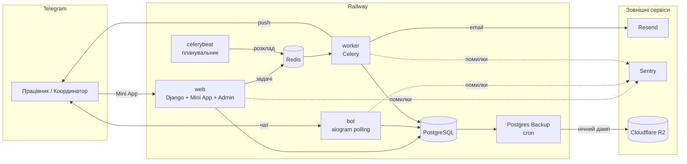

# Apolo — облік відсутностей для агенції праці

[](https://github.com/Brebston/apolo_freedays/actions/workflows/ci.yml)


Telegram Mini App і бот для польської агенції праці. Працівники подають заявки на вихідні, повідомляють про лікарняний (L4) і прикріплюють документ, звертаються до адміністрації чи бухгалтерії — прямо з Telegram, українською, польською, англійською чи російською. Координатори ухвалюють рішення одним дотиком, адміністратори керують усім у Django Admin.

**Мови:** [English](README.md) · Українська

## Зміст

- [Можливості](#можливості)
- [Бізнес-правила](#бізнес-правила)
- [Архітектура](#архітектура)
- [Технології](#технології)
- [Швидкий старт](#швидкий-старт)
- [Налаштування](#налаштування)
- [Розгортання](#розгортання)
- [Django Admin](#django-admin)
- [Обслуговування](#обслуговування)
- [Безпека і приватність](#безпека-і-приватність)
- [Розробка](#розробка)
- [Усунення несправностей](#усунення-несправностей)
- [Плани](#плани)

## Можливості

### Для працівників (Telegram Mini App)

- **Доступ лише за Telegram ID.** Жодної реєстрації чи паролів: адміністратор додає працівника — і застосунок відкривається. Решта бачить свій Telegram ID і кнопку, щоб надіслати його координатору.
- **Вихідні** в календарі, який ще до натискання показує, на які дні вже немає місць і що ви вже подали. Місячний ліміт видно як рядок точок, що заповнюється з кожним обраним днем.
- **Лікарняний (L4)** з документом — фото або PDF, — який автоматично йде координатору листом. Фото стискаються на телефоні перед відправкою (фото на 5.7 МБ стає ~0.8 МБ).
- **Нагадування прикріпити лікарняний** — на екрані підтвердження, на головній і повідомленням бота через два дні, якщо документа досі немає (до трьох разів).
- **Зголошення до адміністрації** (документи: довідка про страхування, *załącznik* тощо) і **до бухгалтерії** (питання щодо зарплати).
- **Залишок вихідних** на поточний і наступний місяць на головній.
- **Скасування власної заявки** — будь-якої, що очікує рішення, або підтвердженого вихідного, який ще не почався.
- **Мої зголошення** — усі заявки зі статусами в одному списку.

### Для координаторів

- Push-сповіщення про кожну нову заявку з кнопками **Підтвердити / Відхилити** прямо в чаті — або рішення в панелі координатора в застосунку. Лікарняний (L4) відхилити не можна.
- Якщо працівник скасовує заявку, кнопки рішення зникають з початкового сповіщення.
- Кожна заявка й кожен лікарняний також приходять **на пошту** (HTML-лист польською).

### Для адміністраторів (Django Admin)

- **Працівники:** по одному або **масовим імпортом з CSV** з попереднім переглядом кожного рядка. Розпізнаються файли з Excel у польському чи кириличному кодуванні та заголовки чотирма мовами.
- **Проєкти й ліміти:** місячний ліміт вихідних на працівника, максимум людей на день і винятки для конкретних дат.
- **Статистика в Excel:** вісім аркушів і шість графіків (за проєктами, місяцями, днями тижня й працівниками), англійською, польською чи українською. Кожне число — жива формула над вихідними даними.
- **Розсилки** всім працівникам або обраним — одноразові чи регулярні (щодня, щотижня, щомісяця), з вибором емодзі.
- **Відділи:** хто отримує зголошення до адміністрації та бухгалтерії. Рішення ухвалюється кнопкою прямо в листі.
- **Лікарняні:** перегляд і завантаження прикріплених файлів на сторінці заявки.

## Бізнес-правила

Це правила, які система виконує. Ліміти й права завжди перевіряються на сервері; календар у застосунку лише показує їх заздалегідь.

### Доступ

- `/start` (і кнопка **🌐 Мова**) завжди спершу пропонує вибрати мову, потім шукає користувача за Telegram ID.
- **Знайдено і Active** → головне меню. **Не знайдено або не Active** → повідомлення «немає доступу» з кнопкою **Дізнатися свій Telegram ID**, яка дає готовий текст для пересилання; меню скорочується до кнопки мови.
- Доступ перевіряється при кожній дії, а не лише на `/start`, тож зняття галочки **Active** діє одразу. Історія заявок зберігається.
- Працівники можуть користуватися і класичним меню бота, і Mini App (кнопка меню **Apolo**) — обидва працюють з тими самими даними.

### Вихідні й лікарняні (L4)

- Минулі дати обрати не можна. Лікарняний — максимум **31 день** в одній заявці.
- **Місячний ліміт** (`Project → day-off limit`): днів вихідних працівника в календарному місяці в цьому проєкті — із заявок, що очікують рішення, і підтверджених, плюс обрані зараз — не може бути більше за ліміт. Відхилені й скасовані не враховуються.
- **Людей на день:** діє ліміт саме для цієї дати; якщо його немає — загальний ліміт проєкту; якщо не задано жодного — обмеження немає. Місце займають заявки, що очікують рішення, і підтверджені; відхилені й скасовані — ні.
- У Mini App не можна подати заявку на дату, на яку у вас уже є заявка, а одночасні подання в один проєкт обробляються по черзі, тож двоє людей не займуть останнє вільне місце разом.
- Після подання всі координатори проєкту отримують push із кнопками рішення, а email-отримувачі проєкту — лист.

### Рішення

- Координатор — користувач зі **Staff**, доданий до координаторів проєкту. Панель координатора показує лише заявки його проєктів; суперкористувач бачить усі.
- Лікарняний (L4) можна лише підтвердити.
- Рішення можна ухвалити лише щодо заявки, яка очікує. Діє перше рішення — повторне натискання покаже «вже опрацьовано».
- Працівник отримує push з рішенням.

### Скасування

- Працівник може скасувати будь-яку заявку, що **очікує рішення**, або **підтверджений вихідний, який ще не почався**. Лікарняний, що вже почався, і опрацьовані зголошення до адміністрації/бухгалтерії скасувати не можна.
- При скасуванні кнопки рішення зникають зі сповіщень координаторів, вони отримують відповідь про скасування, а email-отримувачі проєкту — лист *Anulowano*. Звільнені дні більше не займають жодного ліміту.

### Зголошення до адміністрації та бухгалтерії

- Вільний текст до 2 000 символів, без проєкту й дат.
- Лист іде відповідальним особам відділу (**Departmental points of contact**, To/CC). Використовується актуальний email з їхнього профілю.
- У листі кнопки **Zaakceptuj / Odrzuć**. Посилання відкриває сторінку підтвердження, а рішення застосовується лише після підтвердження (`POST`), тож поштові сканери не можуть його запустити. Вирішити можна лише зголошення, яке очікує; після цього — або після скасування працівником — посилання покаже «вже опрацьовано».
- Працівник отримує push з рішенням.

### Документи лікарняного

- PDF або зображення, до **5 файлів за раз**, **10 на заявку**, **10 МБ на файл** і **25 МБ за раз**. Тип перевіряється за вмістом файлу.
- Надсилаються тим самим адресатам, що й лист про заявку. Пізніше досланий файл приходить листом *Uzupełnienie* (доповнення).
- Нагадування: перше через `SICK_NOTE_REMINDER_AFTER_DAYS`, далі кожні `SICK_NOTE_REMINDER_INTERVAL_DAYS`, максимум `SICK_NOTE_REMINDER_MAX` разів; для відхилених і скасованих заявок — ні.
- Вміст файлів видаляється через `SICK_LEAVE_FILE_RETENTION_DAYS` після відправки; запис (назва, розмір, дати) лишається.

### Листи

| Подія | Хто отримує |
| --- | --- |
| Новий вихідний / лікарняний, скасування, документ лікарняного | Email-отримувачі проєкту (**Projects → email recipients**, To/CC) |
| Нове зголошення до адміністрації / бухгалтерії | Відповідальні особи відділу (**Departmental points of contact**) |

> **Лист надсилається лише тоді, коли в проєкту (або відділу) є хоча б один адресат типу «To».** Якщо адресати лише CC або їх немає, лист не йде — і жодної помилки не видно.

Усі листи польською, з HTML-версією і простим текстом як запасним варіантом.

### Розсилки

- **Кому:** усім активним користувачам або обраним.
- **Одноразова:** надсилається один раз у **Scheduled at** — поле має бути заповнене.
- **Регулярна:** щодня, щотижня (день тижня) або щомісяця (число) о заданий час. Щомісячна розсилка на 31-ше число в коротких місяцях іде в останній день місяця.
- Планувальник перевіряє розклад кожні 5 хвилин, тож розсилка може прийти до 5 хвилин пізніше. Кожна регулярна розсилка надсилається не частіше разу на день, тиждень чи місяць.
- Дія **Send selected broadcasts now** у списку надсилає негайно. Після кожної відправки в списку видно час і скільки повідомлень доставлено чи ні. Обмеження частоти Telegram (429) враховуються автоматично.

## Архітектура



Усі сервіси застосунку зібрані з **одного Docker-образу** і відрізняються лише командою запуску (`entrypoint.sh`):

| Сервіс | Команда запуску | Роль |
| --- | --- | --- |
| `web` | `./entrypoint.sh web` | Накочує міграції, віддає Django Admin, JSON API (`/api/`), Mini App (`/app/`) і посилання рішень з листів |
| `bot` | `./entrypoint.sh bot` | Telegram-бот (long polling); виставляє кнопку меню, що відкриває Mini App |
| `worker` | `./entrypoint.sh celery` | Фонові задачі: листи, push-сповіщення, розсилки |
| `celerybeat` | `./entrypoint.sh celery-beat` | Планувальник — **рівно один екземпляр** |

> `./entrypoint.sh celery-all` запускає worker і планувальник в одному процесі, щоб заощадити ресурси. Використовуйте його **замість** окремих `worker` + `celerybeat`, але ніколи разом з ними: два планувальники надсилають кожну розсилку й нагадування двічі.

### Задачі за розкладом

| Задача | Коли | Що робить |
| --- | --- | --- |
| `check_and_send_due_broadcasts` | кожні 5 хв | Надсилає розсилки, час яких настав |
| `remind_missing_sick_notes` | щодня о 10:00 | Нагадує працівникам прикріпити лікарняний |
| `purge_old_sick_leave_files` | щодня о 03:30 | Видаляє вміст файлів лікарняних, надісланих понад N днів тому (запис лишається) |

Час — `Europe/Warsaw`.

## Технології

| Шар | Технологія |
| --- | --- |
| Бекенд | Python 3.12, Django 5.0, Gunicorn, WhiteNoise |
| Бот | aiogram 3 |
| Фонові задачі | Celery 5 + Redis |
| База даних | PostgreSQL 16 |
| Mini App | React 18 + Vite 5, Telegram WebApp SDK |
| Пошта | [Resend](https://resend.com) через `django-anymail` |
| Моніторинг помилок | [Sentry](https://sentry.io) |
| Хостинг | [Railway](https://railway.com), домен на Cloudflare |
| Резервні копії | шаблон Railway *Postgres Backup* → Cloudflare R2 |
| Excel | openpyxl |

### Структура проєкту

```text
api/            JSON API для Mini App, авторизація через Telegram initData, Celery-задачі сповіщень
bot/            aiogram-бот: хендлери, клавіатури, переклади (bot/locales.py)
config/         Налаштування Django, URL-и, Celery
core/           Моделі, адмінка, шаблони листів, логіка лімітів (services.py),
                перевірка файлів (sick_leave_files.py), Excel-звіт (stats_export.py)
users/          Модель User, адмінка, імпорт з CSV (csv_import.py)
webapp/         React Mini App (src/screens, src/components, src/i18n.js)
entrypoint.sh   Режими запуску для кожного сервісу
```

## Швидкий старт

### Що потрібно

- Docker і Docker Compose
- Node.js 20 (лише щоб зібрати Mini App локально)
- Токен Telegram-бота від [@BotFather](https://t.me/BotFather)

### Локальний запуск

```bash
git clone https://github.com/Brebston/apolo_freedays.git
cd apolo_freedays
cp .env.example .env                   # заповніть значення — див. «Налаштування»

cd webapp && npm install && npm run build && cd ..
docker compose up --build
docker compose exec web python manage.py createsuperuser
```

- Адмінка: <http://localhost:8000/admin/>
- Перевірка стану: <http://localhost:8000/healthz>

Том `.:/app` у Compose перекриває Mini App, зібраний усередині образу, тому його один раз збирають на хості. Після змін у фронтенді повторіть `npm run build`.

Compose запускає `db` і `redis`, чекає, доки вони будуть готові, виконує одноразовий сервіс `migrate` і лише потім стартує `web`, `bot`, `celery` і `celery-beat`.

### Запуск без Docker

Потрібні Python 3.12, PostgreSQL і Redis, запущені локально.

```bash
python3.12 -m venv .venv && source .venv/bin/activate
pip install -r requirements.txt
cp .env.example .env              # POSTGRES_HOST=localhost, REDIS_URL=redis://localhost:6379/0
python manage.py migrate
python manage.py createsuperuser

# чотири термінали:
python manage.py runserver
python manage.py runbot
celery -A config worker -l info
celery -A config beat -l info
```

### Розробка Mini App у браузері

Telegram відкриває Mini App лише через HTTPS, тож для локальної роботи застосунок можна запустити у звичайному браузері. Задайте в `.env` `DJANGO_DEBUG=1` і `WEBAPP_DEV_TELEGRAM_ID=<ваш Telegram ID>`, потім:

```bash
python manage.py runserver        # термінал 1
cd webapp && npm run dev          # термінал 2 → http://localhost:5173
```

Vite проксює `/api` на Django. Обхід за ID працює лише при `DEBUG=1`.

## Налаштування

Усі налаштування — змінні середовища. Їх перелік є в `.env.example`.

### Обов'язкові

| Змінна | Опис |
| --- | --- |
| `DJANGO_SECRET_KEY` | Довгий випадковий рядок. Згенерувати: `python -c "import secrets; print(secrets.token_urlsafe(50))"` |
| `DJANGO_ALLOWED_HOSTS` | Хости через кому, напр. `apolo.blacky.click,.up.railway.app` |
| `CSRF_TRUSTED_ORIGINS` | Повні адреси, напр. `https://apolo.blacky.click` |
| `POSTGRES_DB`, `POSTGRES_USER`, `POSTGRES_PASSWORD`, `POSTGRES_HOST`, `POSTGRES_PORT` | Підключення до бази |
| `REDIS_URL` | Брокер Celery, напр. `redis://redis:6379/0` |
| `BOT_TOKEN` | Токен бота. Ним також перевіряється підпис Mini App, тож він має бути однаковим на всіх сервісах |
| `RESEND_API_KEY` | Ключ Resend для всіх вихідних листів |
| `DEFAULT_FROM_EMAIL` | Відправник, напр. `Apolo <notifications@apolo.blacky.click>`. Домен має бути підтверджений у Resend |
| `SITE_BASE_URL` | Публічна адреса для посилань у листах, напр. `https://apolo.blacky.click` |
| `WEBAPP_URL` | Адреса Mini App для кнопки меню бота, напр. `https://apolo.blacky.click/app/` |

### Необов'язкові

| Змінна | За замовчуванням | Опис |
| --- | --- | --- |
| `DJANGO_DEBUG` | `0` | `1` лише для локальної розробки |
| `SENTRY_DSN` | — | Вмикає моніторинг помилок. Без неї Sentry вимкнений |
| `SENTRY_ENVIRONMENT` | `production` | Назва середовища в Sentry |
| `SICK_NOTE_REMINDER_AFTER_DAYS` | `2` | Перше нагадування через стільки днів після L4 без документа |
| `SICK_NOTE_REMINDER_INTERVAL_DAYS` | `2` | Днів між нагадуваннями |
| `SICK_NOTE_REMINDER_MAX` | `3` | Максимум нагадувань на заявку |
| `SICK_LEAVE_FILE_RETENTION_DAYS` | `90` | Скільки днів зберігати файли лікарняних після відправки |
| `WEBAPP_DEV_TELEGRAM_ID` | — | Лише для розробки в браузері (з `DJANGO_DEBUG=1`) |

`RAILWAY_SERVICE_NAME` Railway задає сам; за нею помилки в Sentry позначаються як `web`, `bot`, `worker` чи `celerybeat`.

## Розгортання

Продакшн працює на Railway за адресою `apolo.blacky.click`.

### 1. Сервіси Railway

1. **New Project → Deploy from GitHub repo**, потім додайте **PostgreSQL** і **Redis**.
2. Створіть `web`, `bot`, `worker` і `celerybeat` з того самого репозиторію, кожному — команду запуску з [таблиці вище](#архітектура). Публічний домен потрібен лише `web`.
3. Дайте всім сервісам однакові змінні (**Variables → Raw Editor**). Значення для бази й Redis посилаються на сервіси Railway:

   ```env
   POSTGRES_DB=${{Postgres.PGDATABASE}}
   POSTGRES_USER=${{Postgres.PGUSER}}
   POSTGRES_PASSWORD=${{Postgres.PGPASSWORD}}
   POSTGRES_HOST=${{Postgres.PGHOST}}
   POSTGRES_PORT=${{Postgres.PGPORT}}
   REDIS_URL=${{Redis.REDIS_URL}}
   ```

4. `celerybeat` — **одна репліка**.

Кожен push у `main` перезбирає всі сервіси. `web` накочує міграції при старті.

### 2. Домен (Cloudflare)

1. Railway: `web` → **Settings → Networking → Custom Domain** → `apolo.blacky.click`. Скопіюйте ціль CNAME.
2. Cloudflare DNS: додайте `CNAME apolo → <ціль>` з **Proxy status: DNS only** (сіра хмаринка). Railway і так стоїть за Cloudflare, а помаранчевий проксі дає помилку 1000.
3. Дочекайтесь зеленої галочки в Railway — сертифікат видається автоматично.

### 3. Telegram

У [@BotFather](https://t.me/BotFather): `/mybots` → ваш бот → **Bot Settings → Configure Mini App** → `https://apolo.blacky.click/app/`. Кнопку меню бот також виставляє при кожному старті.

### 4. Пошта (Resend)

1. Resend → **Domains → Add domain** — домен з `DEFAULT_FROM_EMAIL`.
2. Додайте DNS-записи, які покаже Resend (SPF, DKIM), у Cloudflare DNS і дочекайтесь статусу **Verified**.
3. Resend → **API Keys** → створіть ключ → задайте `RESEND_API_KEY` на `web` і `worker`.

### 5. Моніторинг помилок (Sentry)

1. Створіть у Sentry проєкт **Django** і скопіюйте DSN. За можливості оберіть регіон ЄС.
2. Задайте `SENTRY_DSN` на `web`, `bot`, `worker` і `celerybeat`.
3. **Не** вставляйте приклад `sentry_sdk.init(...)` із Sentry в `settings.py`: ініціалізація вже є, а приклад вмикає `send_default_pii=True`, що в цьому проєкті свідомо вимкнено.

Нова організація Sentry стартує з 14-денного пробного Business і потім сама переходить на безкоштовний план Developer; оплата не потрібна.

### 6. Резервні копії (Cloudflare R2)

Вбудовані бекапи Railway на Hobby можуть бути недоступні й відновлюються лише в межах того самого проєкту, тому нічна копія зберігається **поза Railway**.

1. **Cloudflare R2:** створіть **приватний** bucket `apolo-backups` (юрисдикція ЄС). Додайте правило життєвого циклу: видаляти об'єкти через **30 днів**. Створіть R2 API token з правами **Object Read & Write** лише на цей bucket.
2. **Railway:** **+ Create → Template → Postgres Backup** (від Railway Templates). Задайте:

   ```env
   BACKUP_DATABASE_URL=${{Postgres.DATABASE_URL}}
   AWS_ACCESS_KEY_ID=<R2 access key id>
   AWS_SECRET_ACCESS_KEY=<R2 secret access key>
   AWS_S3_BUCKET=apolo-backups
   AWS_S3_REGION=auto
   AWS_S3_ENDPOINT=<R2 S3 endpoint>
   SINGLE_SHOT_MODE=true
   ```

3. Розклад cron лишіть **Daily**. З `SINGLE_SHOT_MODE` сервіс працює кілька секунд на ніч і вимикається. Видаліть **Bucket** Railway, який створює шаблон, — копії йдуть у R2.

Розгортання шаблону одразу робить першу копію; перевірте, що в bucket з'явився файл.

## Django Admin

Адмінка англійською; її мова задається окремо від бота — `LANGUAGE_CODE` у `config/settings.py`.

| Розділ | Що там |
| --- | --- |
| **Users** | Працівники й координатори. **Active** = доступ до бота; **Staff** = координатор (і вхід в адмінку). Тут же імпорт з CSV |
| **Regions** | Регіони для групування проєктів (Łódź, Warszawa…) |
| **Projects** | Назва, регіон, місячний ліміт вихідних, людей на день (порожньо = без обмежень), координатори, а також — усередині — **email-отримувачі** (To/CC) і ліміти для конкретних дат |
| **Staffing limits for specific dates** | Виняток «людей на день» для однієї дати проєкту |
| **Reporting** | Усі заявки на вихідні й лікарняні з фільтрами; документи лікарняних у кожній заявці; **📊 Statistics (Excel)** |
| **Reporting to Administration/Accounting** | Зголошення до адміністрації й бухгалтерії зі статусами |
| **Departmental points of contact** | Хто отримує зголошення до адміністрації чи бухгалтерії, To/CC — профіль користувача, а не довільна адреса |
| **Newsletters** | Розсилки працівникам |

**Користувачі:**

- Ім'я й прізвище — **лише латиницею й дефісом**, без пробілів, цифр і діакритики.
- Для доступу до бота потрібні лише Telegram ID та ім'я; email, телефон і пароль необов'язкові.
- Пароль потрібен лише тим, хто заходить в адмінку. Без пароля увійти в адмінку не можна, а бот працює як звичайно.

### Щоденні задачі

| Задача | Де |
| --- | --- |
| Дати працівнику доступ | Адмінка → Users → **Add** або **⬆ Import from CSV** |
| Забрати доступ, зберегти історію | Зняти галочку **Active** у користувача |
| Зробити координатором | Галочка **Staff** і додати до координаторів проєкту |
| Налаштувати ліміти | Адмінка → Projects (місячний ліміт, людей на день) і Staffing limits for specific dates |
| Хто отримує зголошення до адміністрації/бухгалтерії | Адмінка → Departmental points of contact |
| Статистика | Адмінка → Reporting → **📊 Statistics (Excel)** |
| Повідомлення працівникам | Адмінка → Newsletters |

Колонки CSV для імпорту: `first_name`, `last_name`, `phone`, `telegram_id` (шаблон можна завантажити на сторінці імпорту). Імена — латиницею.

## Обслуговування

### Перевірка відновлення (щомісяця)

Бекап, який ви ні разу не відновлювали, — лише надія. Раз на місяць завантажте останній дамп з R2 і відновіть його в тимчасову базу:

```bash
docker run -d --name restore-test -e POSTGRES_PASSWORD=test postgres:16
docker exec -i restore-test psql -U postgres < backup.sql      # після розпакування архіву
docker exec restore-test psql -U postgres -c "SELECT count(*) FROM core_absencerequest;"
docker rm -f restore-test
```

Якщо дамп починається з `PGDMP`, замість `psql` використайте `pg_restore -U postgres -d postgres`.

### Сховище

Лікарняні зберігаються в PostgreSQL, а не на диску, бо в кожного сервісу Railway свій тимчасовий диск. Фото спершу стискаються на пристрої, тож близько десяти лікарняних на місяць додають приблизно 15 МБ. Вміст файлів автоматично видаляється через `SICK_LEAVE_FILE_RETENTION_DAYS`, вручну чистити нічого не треба. Після переходу з Trial на Hobby розширте диск Postgres через **Live Resize** — сам він не збільшується.

## Безпека і приватність

Застосунок працює з персональними й медичними даними (лікарняні), тож приватність закладено в основу:

- **Доступ за білим списком.** Бот і застосунок доступні лише користувачам, яких додав адміністратор. Прапорець `Active` миттєво забирає доступ.
- **Підписані запити.** Кожен виклик API містить `initData` від Telegram, що перевіряється HMAC-SHA256 за `BOT_TOKEN` і відхиляється через 24 години.
- **Перевірка файлів.** Тип файлу визначається за вмістом, а не за розширенням. Приймаються PDF і поширені формати зображень, зокрема HEIC з iPhone; замасковані виконувані файли відхиляються. Діють обмеження на розмір і кількість.
- **Посилання рішень у листах.** Кожне зголошення до адміністрації чи бухгалтерії отримує випадковий 32-байтовий токен. Посилання лише відкриває сторінку підтвердження, а рішення застосовується через `POST`, тож поштові сканери не можуть його випадково запустити.
- **Sentry** працює з `send_default_pii=False` і не отримує тіл запитів.
- **Розташування даних.** R2 і Sentry — у регіонах ЄС; bucket R2 приватний.
- **Сесії адмінки** завершуються після 10 хвилин неактивності.

## Розробка

### Міграції

Міграції комітяться в Git, а контейнери лише накочують їх. Після зміни моделі:

```bash
python manage.py makemigrations users core
git add core/migrations users/migrations
```

CI падає, якщо модель змінено без міграції.

> **`git commit -a` і `git add -u` не додають нові файли.** Перевірте `git status` і додайте невідстежувані файли явно — забутий новий модуль найчастіше і є причиною червоного CI.

### Безперервна інтеграція

GitHub Actions (`.github/workflows/ci.yml`) запускається на кожен push і pull request у `main`:

| Джоба | Що перевіряє |
| --- | --- |
| `django-checks` | Синтаксис, `manage.py check`, відсутні міграції, міграції на PostgreSQL 16 + Redis 7, `collectstatic` |
| `docker-build` | Збирає образ, валідує `docker-compose.yml` |
| `webapp-build` | Збирає Mini App |

### Додавання мови

1. Mini App: додайте словник у `webapp/src/i18n.js` (разом з назвами місяців і днів тижня).
2. Бот: додайте ключ у кожен запис `TEXTS` у `bot/locales.py` і назви в `bot/keyboards/calendar.py`.
3. Додайте мову в `users.models.Language`, створіть міграцію і додайте її до вибору мови.

Мова Django Admin незалежна від бота: `LANGUAGE_CODE` у `config/settings.py`.

## Усунення несправностей

| Симптом | Причина і рішення |
| --- | --- |
| CI: `ImportError` / `cannot import name` | Новий файл не закомічено. `git status`, потім `git add` невідстежуваних файлів |
| CI: падає `makemigrations --check` | Модель змінено без міграції — виконайте `makemigrations` і закомітьте |
| Бот мовчить, немає кнопки меню **Apolo** | Сервіс `bot` не працює: перевірте команду запуску й логи |
| `TelegramConflictError` | Той самий `BOT_TOKEN` працює у двох місцях — зупиніть інший екземпляр |
| Розсилки чи нагадування приходять двічі | Два планувальники: `celery-all` разом з `celerybeat` або кілька реплік `celerybeat` |
| Mini App пише «Відкрийте через Telegram» | Відкрито поза Telegram, або `BOT_TOKEN` на `web` відрізняється від токена бота |
| `/app/` показує «Mini App не зібрано» | Не пройшла збірка фронтенду — перевірте build-лог `web` |
| Листи не приходять | У проєкту чи відділу немає адресата **To**; немає `RESEND_API_KEY` на `worker`; або домен відправника не підтверджено в Resend |
| Кнопка в боті «крутиться» і нічого не відбувається | Помилка в обробнику — дивіться логи `bot` (і Sentry) в момент натискання |
| Заблокований користувач досі бачить повне меню | Telegram тримає стару клавіатуру до наступного повідомлення — користувачу варто надіслати `/start` |
| Адмінка без стилів або немає вибору емодзі | Не зібрана статика — перезапустіть `web` (він виконує `collectstatic`) і оновіть сторінку з очищенням кешу |
| `WORKER TIMEOUT` у логах `web` | Запит тривав понад 60 с — зазвичай дуже великий файл на повільному з'єднанні; дивіться `--timeout` в `entrypoint.sh` |
| CI не запускається після push | Гілки немає в `on: push: branches` у `ci.yml`, або Actions вимкнені в налаштуваннях репозиторію |
| Кнопки в листах ведуть на `localhost` | Не задано `SITE_BASE_URL` |
| `DisallowedHost` / CSRF 403 в адмінці | Домену немає в `DJANGO_ALLOWED_HOSTS` / `CSRF_TRUSTED_ORIGINS` |
| Власний домен без зеленої галочки | Неправильний CNAME або ввімкнено проксі Cloudflare — поставте **DNS only** |
| Одноразова розсилка не пішла | Порожнє поле `Scheduled at` — заповніть його або скористайтесь **Send now** |

## Плани

- **Зберігати діалоги бота між перезапусками:** перенести стани aiogram з пам'яті в Redis. Зараз незавершений діалог у класичному меню бота губиться при кожному перезапуску — а на Railway це кожен push.
- **Перевіряти приналежність до проєкту для кнопок рішень у боті**, як це вже робить API Mini App. Зараз кнопки отримують лише координатори проєкту, але сам обробник перевіряє тільки прапорець Staff.
- **Пагінація** в панелі координатора (бот показує останні 30 заявок, застосунок — останні 100).
- **Захист від флуду** в боті.
- **Розсилки мовою отримувача.**
